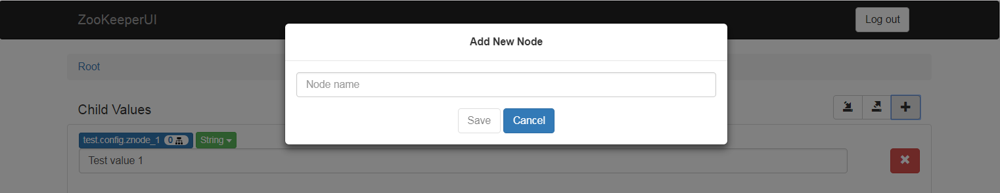
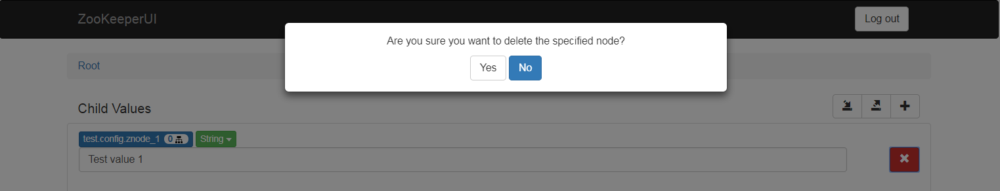
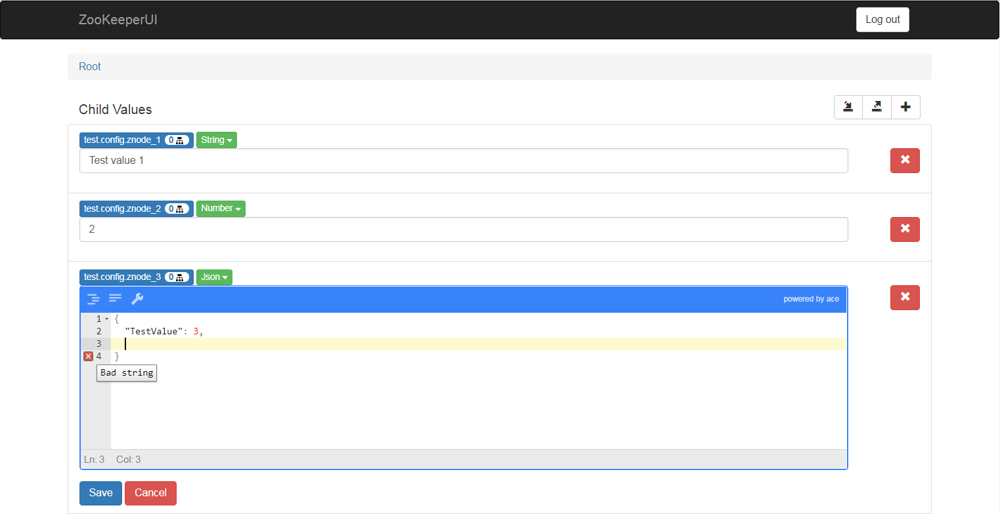
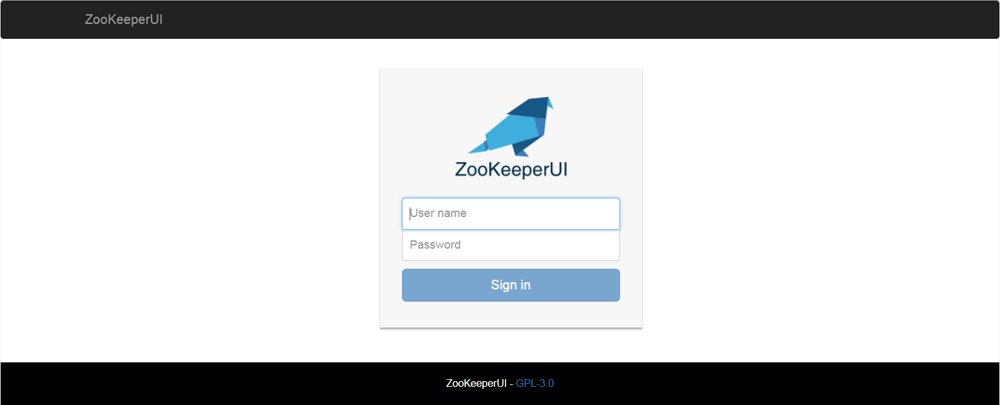

# ZooKeeperUI

Angular 4 web application and Spring Boot REST API that act as a user interface for ZooKeeper. 

In order to use the Angular 4 application you also need to deploy the REST API and configure the Angular 4 application to point to it. You can review the specific documentation of configuration of both, the Angular 4 application and the REST API, in order to learn more about this topic.

## Features:

Listing of existing znodes and their values, with navigation between znodes and their children.


Addition and deletion of znodes children.




Edition of znodes values. It is possible to select the znode data type, obtaining a specific UI input for each data type.


Exporting a selected znode (including its value and children) into a JSON file.

Importing a previously exported JSON file into a selected znode.

Authentication based in a configuration file or, in the near future, your own authentication provider. You can learn more about authentication in the *Configuration* sub-section in the ZooKeeperUI REST API section.


Protection of reserved znodes: 

* The `/zookeeper'  znode is not shown in the listing.
* Both, `/` and `/zookeeper` cannot be set a value nor deleted.

## ZooKeeperUI Angular 4 App

The ZooKeeperUI Angular 4 App provides de user interface of the ZooKeeperUI project. In the following subsections you will find information about how to build, run and configure the app.

### Building and running

ZooKeeperUI Angular 4 App has been scafolded using [Angular CLI](https://cli.angular.io/). In order to build a distributable of the application (in order to deploy it into a web server) or run the application locally you will to install Angular CLI (if it is not already installed in your computer). 
In order to install Angular CLI you can use [npm](https://www.npmjs.com/): 
```
npm install -g @angular/cli
```

In order to run the application locally, you can run `ng serve` in the base directory of the Angular app (`zookeeper-ui/zookeeper-ui-web`). A local web server will be run and the application will be automatically served at http://localhost:4200.

In order to build a distributable of the application you can run `ng build` in that same directory. A sub-directory named `dist` will be created containing a distributable version of the app. You can deploy the contents of that `dist` directory in the web server of your choice.

### Configuration

The ZooKeeperUI Angular 4 App contains a file named `config.json` in the `assets` directory. You can edit that file in order to alter the configuration of the Angular app. The following is the list of currently available configuration entries:

Keyword | Accepted Values | Description 
------- | --------------- | ----------- 
zooKeeperServiceBaseUrl | URL | The base URL in which the ZooKeeperUI REST API is listening. For instance: http://localhost:8080

## ZooKeeperUI REST API

The ZooKeeper REST API provides support for the ZooKeeperUI web application. The API provides different endpoints to access and modify ZooKeeper ZNodes.

In order to navigate through the API you can:

* Take the Swagger specification file `zookeeper-ui/swagger/zookeeper-res-api.swagger.yml` and open it with an online Swagger editor (like http://editor.swagger.io and http://editor2.swagger.io).
* Run the API and access the inline Swagger documentation, at http[s]://<server>:<port>/swagger-ui.html. For example, if you run the API locally in the default port, the Swagger inline documentation will be available at http://localhost:8080/swagger-ui.html.

### Building and running

The ZooKeeper REST API is a Spring Boot standalone application. It can be directly run from the command line, without having to deploy it in an application server (which makes it very easy to deploy using containers). The API uses [gradle](https://gradle.org/) as build system. Gradle is already embedded in the project, so you won't have to install it manually. However, in order to run gradle you need Java JRE 1.8 or later installed in your computer.

In order to build the ZooKeeper REST API you can run the following command in the directory containing the sources of the REST API (`zookeeper-ui/zookeeper-rest-api`):
```bash
> ./gradlew build
```

By default, the build will also run the unit tests. Run the following command if you want to exclude the tests from the build:
```bash
> ./gradlew build -x test
```

As a result of the build, a JAR file containing the API and all of its dependencies will be generated at `build/libs`. You can run directly run that JAR using `java -jar`. For example:
```bash
> cd build/libs
> java -jar zookeeper-rest-api-0.0.1-SNAPSHOT.jar
```

In addition to directly executing the JAR file, you can also directly run the API with gradle:
```bash
> ./gradlew bootRun
```

It is possible to explicitly run the API tests via the `gradlew test` command.

#### Authentication

All the operations of this API are authenticated via JWT in HTTP cookies. In order to start a new player session you need to invoke the `POST /sessions` operation, providing some user credentials. This operation will include an `ACCESS_TOKEN` cookie in the returned response, containing an authentication token.  This cookie must be provided in any subsequent call to the API in order to be correctly authenticated. If you are accessing this API from a web application running in a browser, the browser will already do it for you.

The returned `ACCESS_TOKEN` cookie will expire after a configurable amount of time. In order to keep your session open you have to refresh your session via the `PUT /sessions/current` operation.

A default user details service is included, that retrieves user details from the `users.users_details` configuration property, which is an array of user name and password tuples (review the *Configuration* section for more information). As this is a Spring Boot application, the `users.users_details` configuration property can be provided via a configuration file, environment variables, command line arguments, and Java properties. 

In the near future, in addition to the default authentication provider, you will be able to provide your own by implementing the UserDetailsService interface (from Spring Security) and adding your implementation to the classpath when running the application.

In order to allow users to access the API, not only have them to be authenticated, but they also need to provide the appropriate user claims. User claims grant the user permissions to perform some certain actions. Currently the only requested claim for the whole application is `ZOOKEEPER_USER`. 

If you are using the default user details service (based on configuration properties), all the authenticated users will have this permission included by default. If you are using your custom user details service, you will have to make sure that the users have the `ZOOKEEPER_USER` claim.

#### CSRF Protection

The ZooKeeper REST API is protected against [Cross-Site Request Forgery (CSRF) attacks](https://docs.spring.io/spring-security/site/docs/current/reference/html/csrf.html). This way, when you start a new session in the API an `XSRF-TOKEN` cookie will be returned in the response. When you perform any subsequent call to the API you have to provide both:

* The `XSRF-TOKEN` cookie.
* An `X-XSRF-TOKEN` HTTP header containing the same value that was provided to you in the `XSRF-TOKEN` cookie.

In case no `XSRF-TOKEN` and `X-XSRF-TOKEN` are provided, or they contain an invalid value, a `403 - Forbidden' response will be returned.

If you are invoking the API from an Angular application, this will be automatically done for you.

### Configuration

The ZooKeeper REST API uses the standard Spring Boot properties framework (see: http://docs.spring.io/spring-boot/docs/current/reference/html/boot-features-external-config.html).

This way, properties can be set from command line arguments, environment variables, java system properties, configuration files (either in YAML or Java properties format), etc. These different property sources are read in order, from more static forms of configuration to more dynamic ones, in a way in which more dynamic configurations overwrite those more static. The order in which the configuration is read is the following one:

* Default configuration file embedded into the application.
* Configuration file found in the work directory of the application.
* Environment variables.
* Java properties.
* Command line arguments.

In addition, as the standard Spring Boot properties framework is used, all the common properties (https://docs.spring.io/spring-boot/docs/current/reference/html/common-application-properties.html) can be used in the service as well. For example, it is possible to change the port in which the service will listen (8080 by default): `java -jar build/libs/zookeeper-rest-api-0.0.1-SNAPSHOT.jar --server.port=9000`. 

The following is the list of application specific configuration keywords:

| Keyword  | Description  | Possible Values |
|---|---|---|
| zookeeper.connection_string | The connection string to access ZooKeeper. Example: `192.168.1.36:2181,192.168.1.37:2181`. | Comma separated list of <host>:<port> values. |
| jwt.timeout_seconds | Seconds of expiration of the generated JSON Web Tokens for the user sessions. The generated tokens will expire when the specified number of seconds have passed after the session started. Example, `1800` (30 minutes). | Positive integer. | 
| jwt.secret | Secret key to use when signing the generated JSON Web Tokens. This value should be different in each installation and must be secret. If this configuration value is compromised, the whole security of your REST API will be compromised as well. | String. | 
| cors.allowed_origins | The allowed domains from which the API can be invoked in Cross-Origin Requests. `*` means any domain. Example: `localhost`. The default value is `*`. | Domain name or `*` |
| cors.allowed_headers | The allowed HTTP headers in Cross-Origin Requests. `*` means any header. Example: `OPTIONS,GET,POST,PUT,DELETE`. The default value is `*`. | Comma separated list of HTTP headers or `*`. |
Domain name or `*` |
| cors.allowed_methods | The allowed HTTP methods in Cross-Origin Requests. `*` means any method. Example: `Accept, Origin, Content-type, Authorization, X-Request-ID, X-XSRF-TOKEN, Cookie, Set-Cookie`. The default value is `*`.  | Comma separated list of HTTP methods or `*`. |
| users.users_details | Array of configured users that will be available when creating a new session in the API. Each user entry in the array will contain a `name` and a `password` property respectively containing the user name and the password of the user.

The following is an example of a YAML configuration file:
```yaml
zookeeper:
  connection_string: 127.0.0.1:2181

jwt:
  secret: YourJWTSecretPassword
  timeout_seconds: 1800

cors:
  allowed_origins: '*'
  allowed_headers: '*'
  allowed_methods: '*'

users:
  users_details:
    -
      name: Admin
      password: AdminSecretPassword
    -
      name: User1
      password: User1SecretPassword
```


